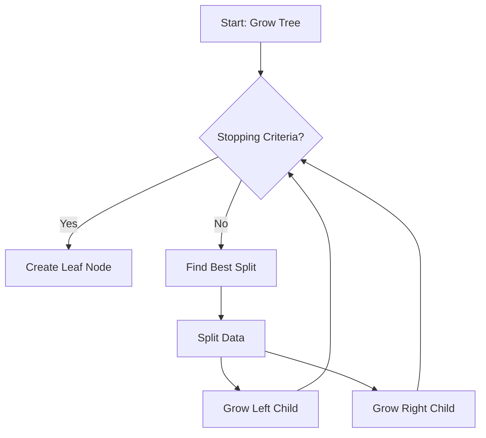

# Algorithm 06: Decision Tree (CART)

## 1. Overview
Classification and Regression Trees (CART) is a fundamental non-parametric supervised learning method used for classification and regression. The goal is to create a model that predicts the value of a target variable by learning simple decision rules inferred from the data features.

## 2. Mathematical Core

### 2.1 Gini Impurity
We use Gini Impurity to measure the "purity" of a node. For a set of items with $J$ classes, the Gini impurity $G$ is:

$$G = 1 - \sum_{i=1}^{J} p_i^2$$

where $p_i$ is the probability of an item being classified to class $i$.

### 2.2 Information Gain (Gini Gain)
When splitting a parent node into left and right children, we aim to minimize the weighted Gini impurity of the children:

$$Gain = G_{parent} - \left( \frac{N_{left}}{N} G_{left} + \frac{N_{right}}{N} G_{right} \right)$$

We select the split (feature and threshold) that maximizes this Gain.

## 3. Algorithm Flow

## 4. Hyperparameters
- `max_depth`: Maximum depth of the tree.
- `min_samples_split`: Minimum number of samples required to split an internal node.
- `min_impurity_decrease`: A node will be split if this split induces a decrease of the impurity greater than or equal to this value.
