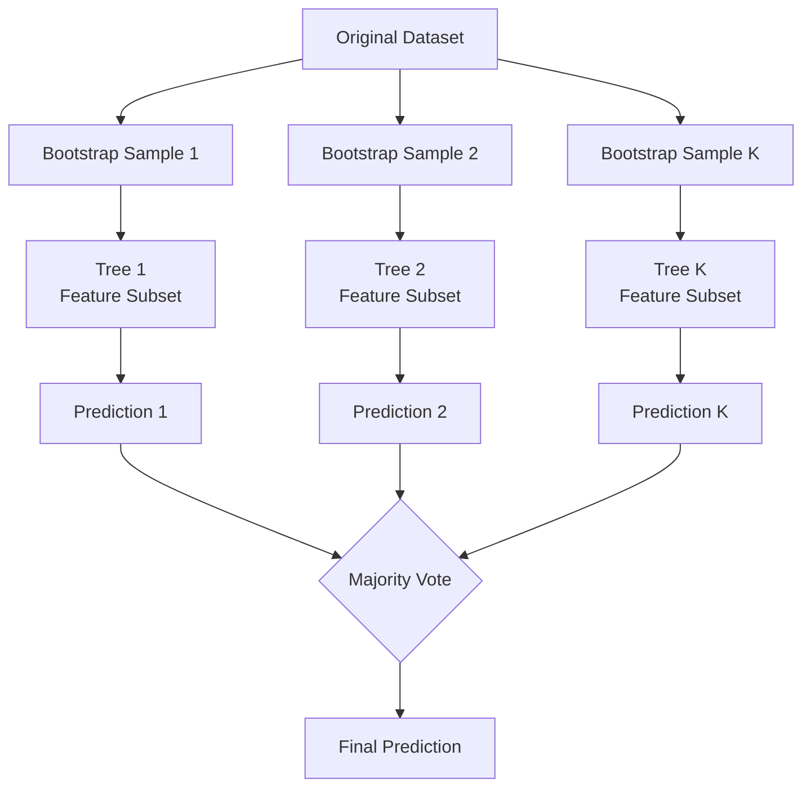

# Algorithm 07: Random Forest

## 1. Overview
Random Forest is a powerful ensemble learning method that constructs a multitude of decision trees during training. It corrects the decision tree's habit of overfitting to their training set. For classification tasks, the output is the class selected by most trees (majority vote).

## 2. Core Concepts

### 2.1 Bagging (Bootstrap Aggregating)
Bagging involves training each decision tree on a random sample of the training data drawn *with replacement*. This means some samples may appear multiple times in a single tree's training set, while others may not appear at all.

### 2.2 Feature Randomness
To ensure the individual trees are de-correlated, Random Forest introduces feature randomness. When looking for the best split at a node, the algorithm only considers a random subset of all available features (typically $\sqrt{m}$ where $m$ is the total number of features).

### 2.3 Out-Of-Bag (OOB) Error
Since each tree is trained on a bootstrap sample, approximately one-third ($\approx 36.8\%$) of the data is left out for each tree. These left-out samples are called the Out-Of-Bag (OOB) samples. We can use them to evaluate the model's performance without needing a separate validation set.

For each sample, we collect predictions from only the trees that did *not* use it during training. We then aggregate these predictions to calculate the OOB Score.

## 3. Algorithm Architecture

